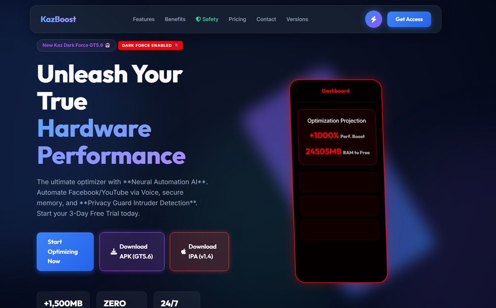
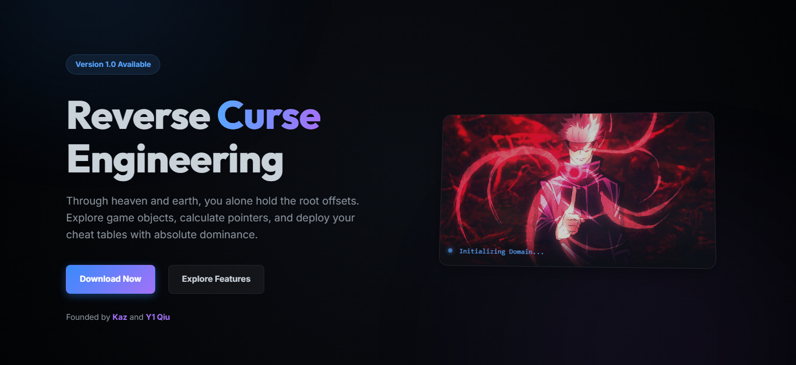
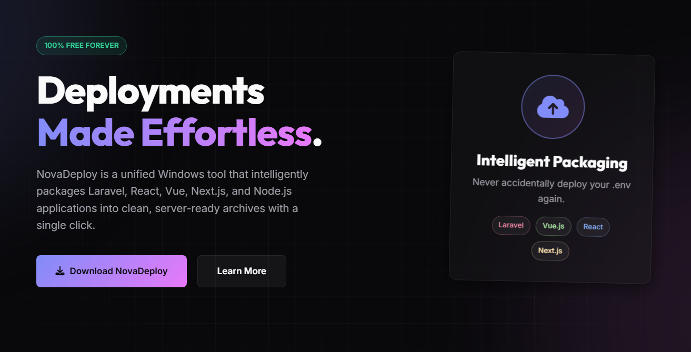
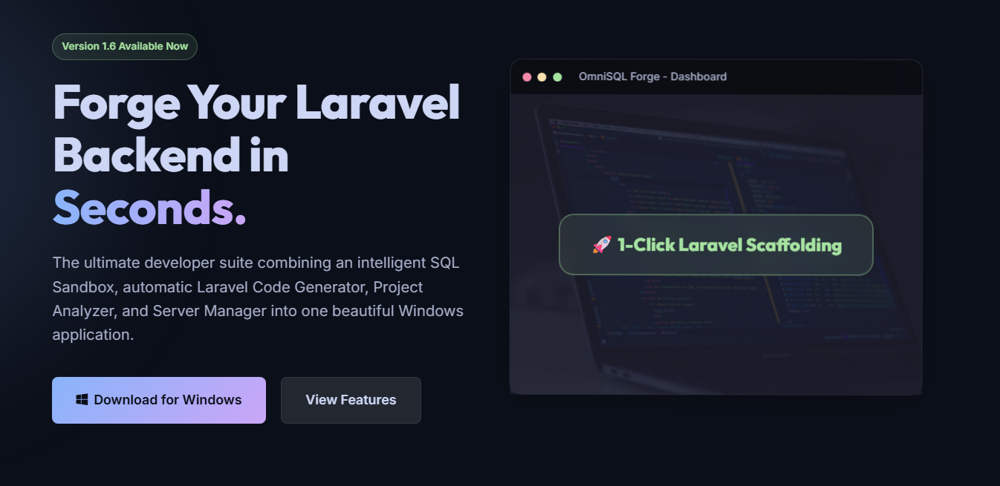

  

  

 

  

---

### 👨‍💻 About Me

Welcome to my GitHub profile! I am a passionate **Developer & 3D Artist** focused on creating seamless web experiences, interactive games, and 3D animations. 

- 🔭 I’m currently working on **Blender Models, Animations, Android & Roblox Games**, alongside **Vue JS projects**
- 🌱 I’m currently refining my skills in **Game Development, 3D Modeling (Blender), Vue.js, and PHP**
- 💬 Ask me about **Game Dev, Blender, JavaScript, Vue, PHP, and Frontend UI**
- ⚡ **Fun fact**: *"If something is going to end doesn't mean you can't enjoy it to the fullest"*

---

### 🛠️ Tech Stack

  
| Category | Technologies |
| :---: | :--- |
| **Frontend** |       |
| **Backend / BaaS** |      |
| **Mobile Development**|        |
| **Tools and Utilities** |       |

---

### 🚀 Top Projects

Feel free to explore my latest projects and live demos!

  <table bordercolor="#30363d">
    <tr>
      <td width="33%" valign="top" align="center">
        
          <b><a href="https://lifeph.netlify.app/">LifePH ✨</a></b>
        
A mobile application project built with Kotlin.

      </td>
      <td width="33%" valign="top" align="center">
        
          <b><a href="https://kazboost.netlify.app/">Kazboost 🚀</a></b>
        
A performance boost utility.

      </td>
      <td width="33%" valign="top" align="center">
        
          <b><a href="https://reversecurseengineering.netlify.app/">Reverse Curse Engineering 🛠️</a></b>
        
Deep dive into Ghidra and software manipulation.

      </td>
    </tr>
    <tr>
      <td width="33%" valign="top" align="center">
        
          <b><a href="https://novadeploy.netlify.app/">NovaDeploy ☁️</a></b>
        
Automated toolings for software deployment.

      </td>
      <td width="33%" valign="top" align="center">
        
          <b><a href="https://omniforgesql.netlify.app/">OmniForge 🗄️</a></b>
        
SQL Database Management systems and architecture.

      </td>
      <td width="33%" valign="top" align="center">
        
          <b><a href="https://github.com/StefanSalvatoreWP/Smartmonitoring">Smartmonitoring 📊</a></b>
        
Capstone JavaScript project for monitoring.

      </td>
    </tr>
  </table>

---

  

