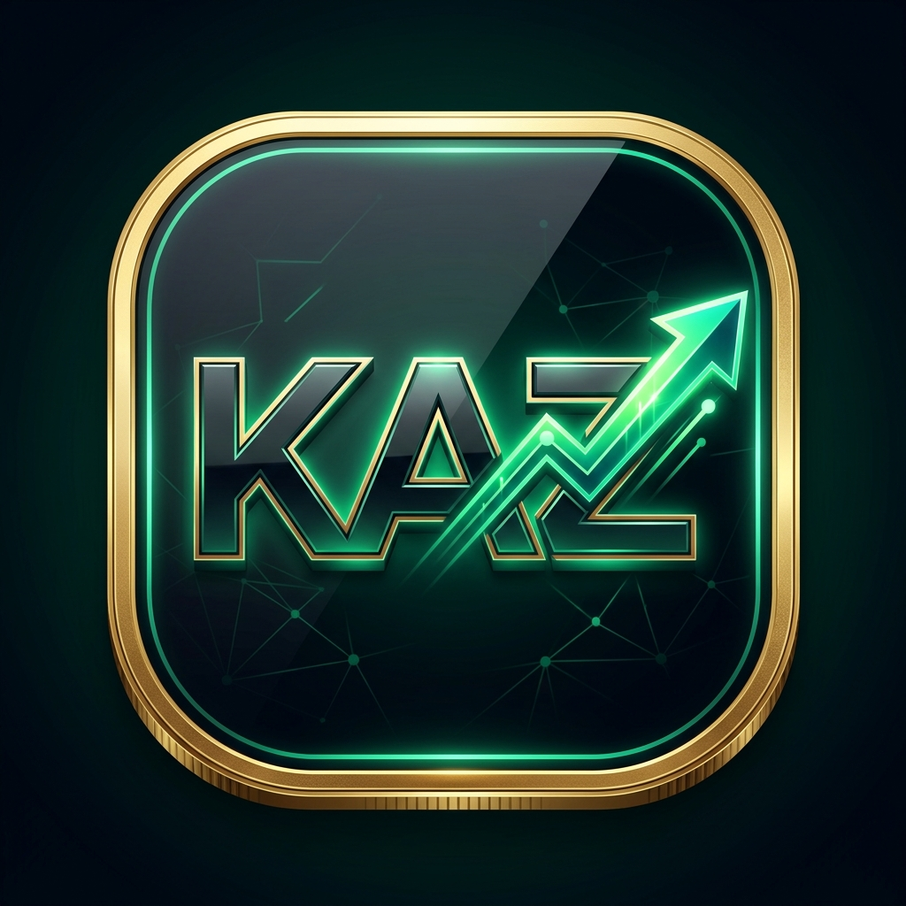
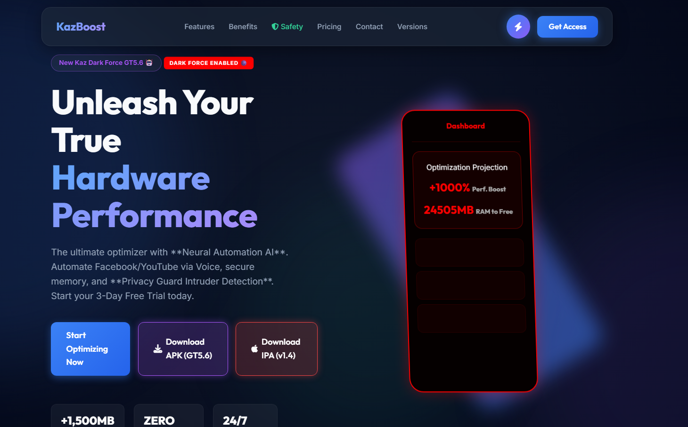
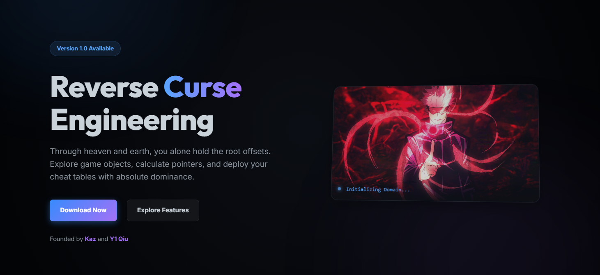
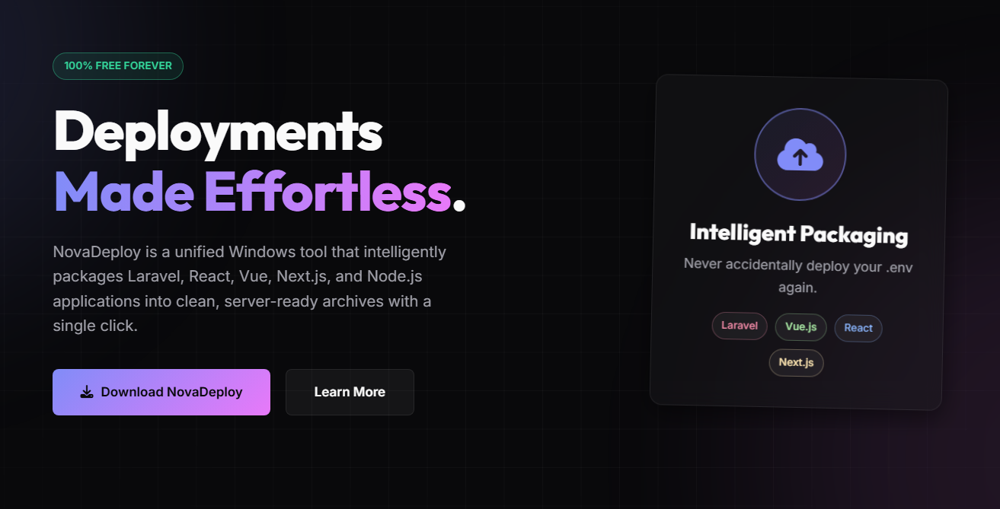
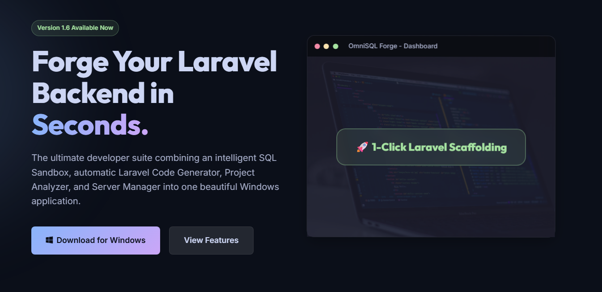

  

  

  

 

  

---

### About Me

Welcome to my GitHub profile! I am a passionate **Developer & 3D Artist** focused on creating seamless web experiences, interactive games, and 3D animations. 

- I’m currently working on **Blender Models, Animations, Android & Roblox Games**, alongside **Vue JS projects**
- I’m currently refining my skills in **Game Development, 3D Modeling (Blender), Vue.js, and PHP**
- Ask me about **Game Dev, Blender, JavaScript, Vue, PHP, and Frontend UI**
- **Fun fact**: *"If something is going to end doesn't mean you can't enjoy it to the fullest"*

---

### Tech Stack

  
| Category | Technologies |
| :---: | :--- |
| **Frontend** |       |
| **Backend / BaaS** |      |
| **Mobile Development**|        |
| **Tools and Utilities** |       |

---

### Top Projects

Feel free to explore my latest projects and live demos!

  <table bordercolor="#30363d">
    <tr>
      <td width="50%" valign="top" align="center">
        
          <b><a href="https://newsurelifetest-slcprogram.surelifenetworkglobal.co/">SureLife Network Global</a></b>
        
Comprehensive SLC program management & networking platform.

        
      </td>
      <td width="50%" valign="top" align="center">
        
          <b><a href="https://kazfinance.netlify.app/">KazFinance</a></b>
        
Modern personal finance tracker and smart budgeting platform.

        
      </td>
    </tr>
    <tr>
      <td width="50%" valign="top" align="center">
        
          <b><a href="https://lifeph.netlify.app/">LifePH</a></b>
        
A mobile application project built with Kotlin.

        
      </td>
      <td width="50%" valign="top" align="center">
        
          <b><a href="https://kazboost.netlify.app/">Kazboost</a></b>
        
A high-efficiency performance boost utility.

        
      </td>
    </tr>
    <tr>
      <td width="50%" valign="top" align="center">
        
          <b><a href="https://reversecurseengineering.netlify.app/">Reverse Curse Engineering</a></b>
        
Deep dive into Ghidra and software reverse engineering manipulation.

        
      </td>
      <td width="50%" valign="top" align="center">
        
          <b><a href="https://novadeploy.netlify.app/">NovaDeploy</a></b>
        
Automated cloud tooling for modern software deployment.

        
      </td>
    </tr>
    <tr>
      <td width="50%" valign="top" align="center">
        
          <b><a href="https://omniforgesql.netlify.app/">OmniForge</a></b>
        
SQL database management systems and query architecture.

        
      </td>
      <td width="50%" valign="top" align="center">
        
          <b><a href="https://github.com/StefanSalvatoreWP/Smartmonitoring">Smartmonitoring</a></b>
        
Capstone JavaScript project for real-time monitoring and analytics.

        
      </td>
    </tr>
  </table>

---

### GitHub Activity & Stats

  
  &nbsp;
  

 

  

---

  

